# Todo List App - TaskRitual 📝🎯

<div align="center">

[](https://reactjs.org/) [](https://vitejs.dev/) [](https://developer.mozilla.org/) [](https://tailwindcss.com/) [](https://reactrouter.com/)

</div>


## 📖 Project Description

**TaskRitual** is a modern, high-performance task management application designed to keep you organized in style. It features a beautiful custom "Neon Ritual" dark theme, smooth animations, and a highly responsive user interface.

Beyond its clean design, the application is built with a focus on secure routing, robust state management, and scalable architecture. Developed using modern web technologies:

* **React** (State Management & UI)
* **Vite** (Fast Build Tool)
* **JavaScript** (Application Logic)
* **Tailwind CSS** (Utility-first Styling & Custom Theme)
* **React Router** (Secure & Dynamic Navigation)

## 🌐 Live Demo ⚡
*(Coming soon)*

## 📸 Screenshots 🖼️
<div align="center">
  <table>
    <tr>
      <th align="center">Screen</th>
      <th align="center">Desktop View</th>
      <th align="center">iPad Pro</th>
      <th align="center">iPhone 14 Pro Max</th>
    </tr>
    <tr>
      <td align="center"><strong>Task Dashboard</strong></td>
      <td align="center">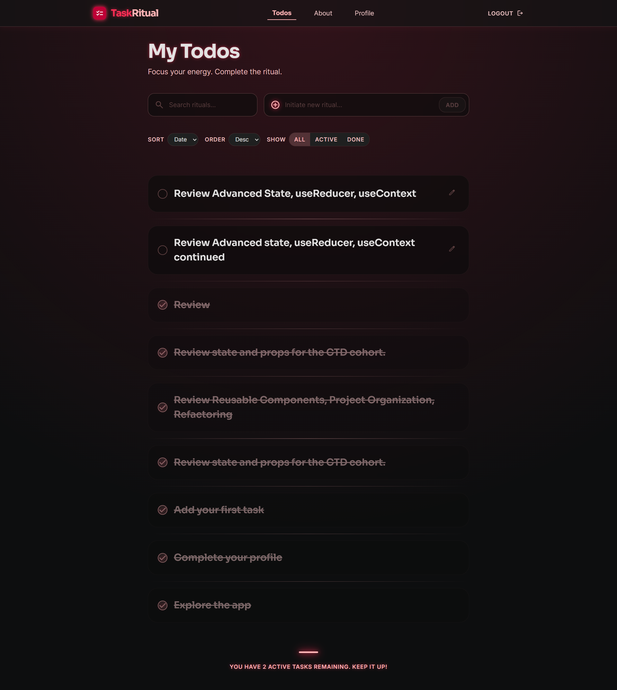</td>
      <td align="center">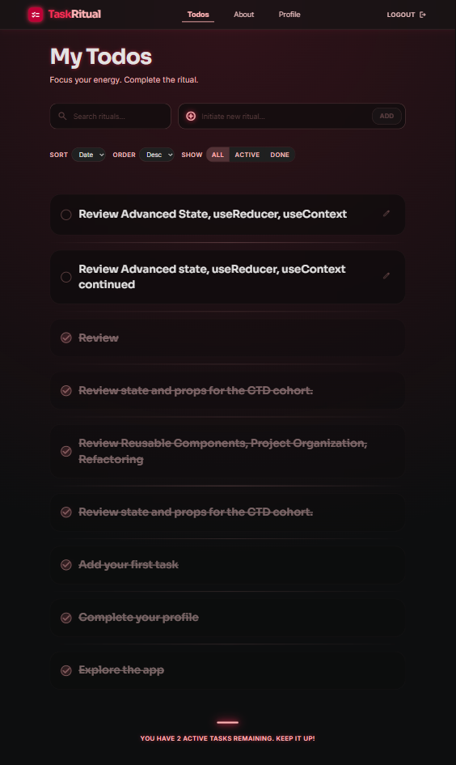</td>
      <td align="center">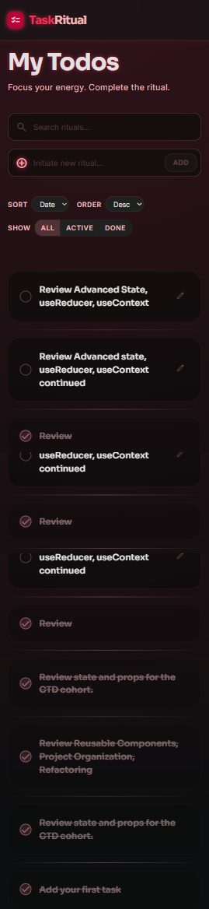</td>
    </tr>
    <tr>
      <td align="center"><strong>Login Portal</strong></td>
      <td align="center">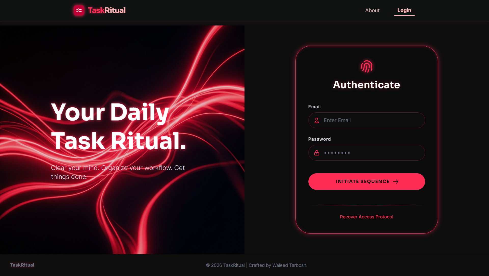</td>
      <td align="center">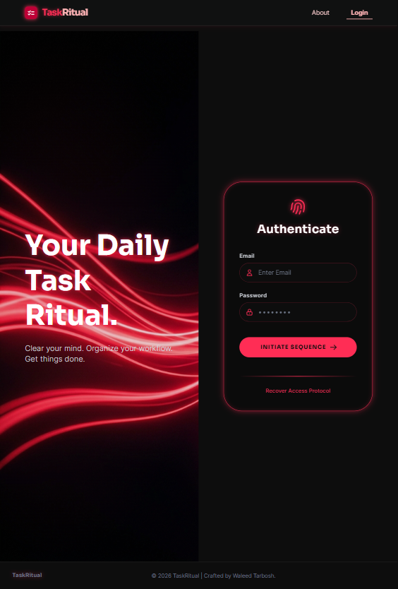</td>
      <td align="center">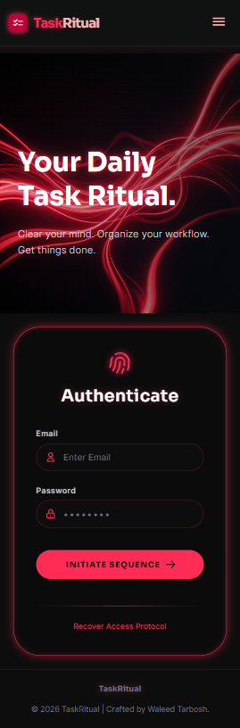</td>
    </tr>
    <tr>
      <td align="center"><strong>User Profile</strong></td>
      <td align="center">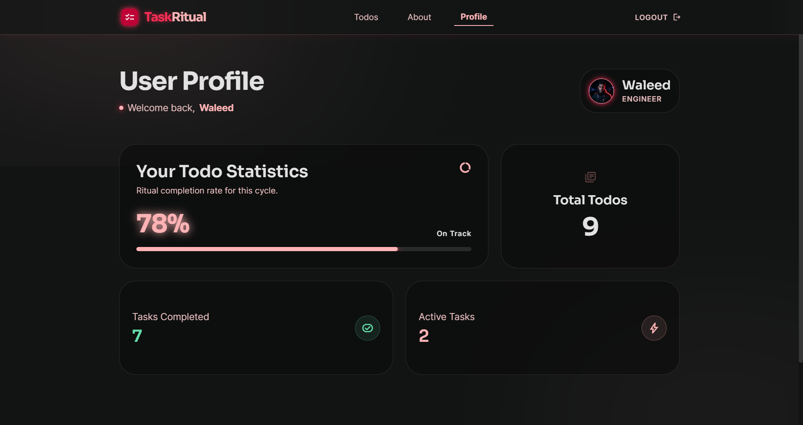</td>
      <td align="center">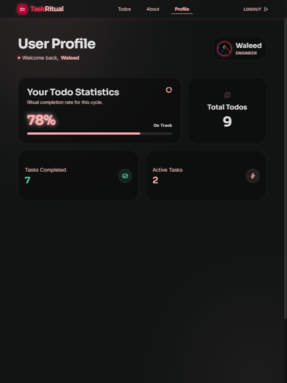</td>
      <td align="center">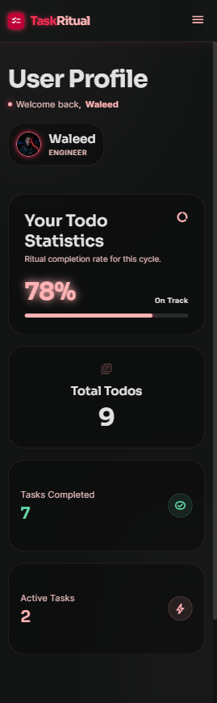</td>
    </tr>
    <tr>
      <td align="center"><strong>About Page</strong></td>
      <td align="center">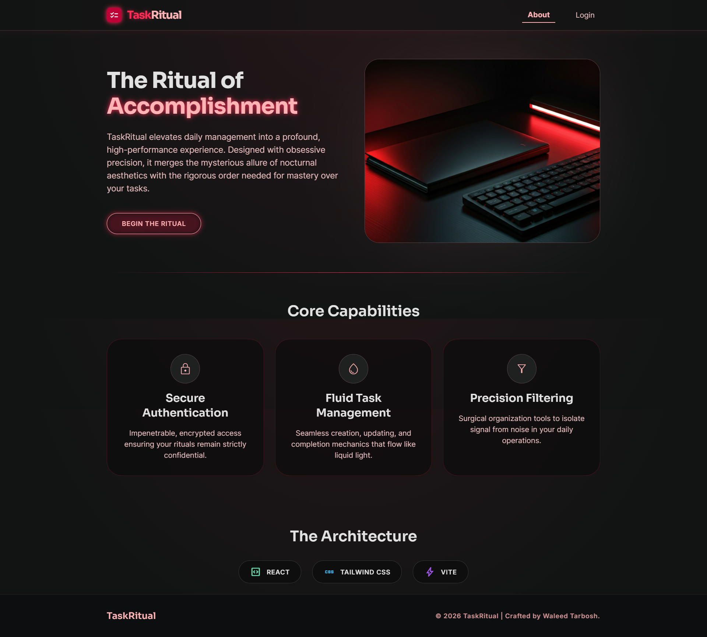</td>
      <td align="center">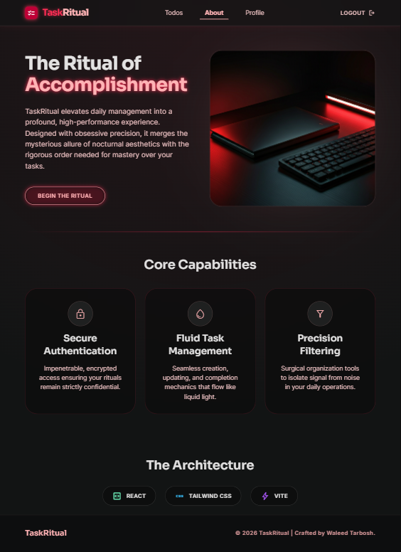</td>
      <td align="center">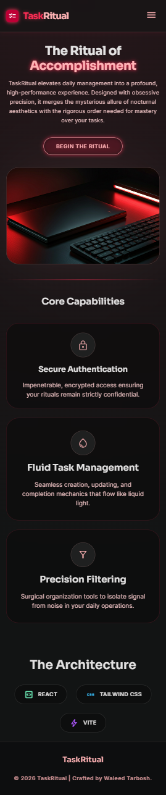</td>
    </tr>
  </table>
</div>

## 📖 Table of Contents
* [🛠️ Technologies & Styles Used 🎨](#️-technologies--styles-used-)
* [✨ Core Features & Pages](#-core-features--pages)
* [📂 Folder Structure](#-folder-structure)
* [🚀 Installation Instructions](#-installation-instructions)
* [💻 How to run the development server](#-how-to-run-the-development-server)
* [🤝 How to Contribute](#-how-to-contribute)
* [✍️ Author](#️-author)

---

## 🛠️ Technologies & Styles Used 🎨

- **Frontend Core:** React 19, React Router 7
- **Styling:** Tailwind CSS v4 (Custom `index.css` Design System with Glassmorphism and Neon Glows)
- **State Management:** `useReducer`, Context API (`AuthContext`)
- **Build Tool:** Vite
- **Code Quality:** ESLint

---

## ✨ Core Features & Pages

TaskRitual is split into several secure and public zones, providing a seamless user experience:

* **Authentication (`/login`)**: A visually stunning login portal with dynamic loading states and secure token handling.
* **Dashboard (`/todos`)**: The core workspace. Features liquid-smooth interactions for adding, completing, and updating tasks. Includes:
  * **Precision Filtering:** Filter by status (Active, Completed, All) and search by text with debounce optimization.
  * **Smart Empty States:** Dynamic visual feedback when no tasks match the current filter.
* **User Statistics (`/profile`)**: A beautiful bento-grid dashboard summarizing the user's progress, showing total tasks, completion rates, and animated progress bars.
* **Information & Error Handling**: 
  * **About Page (`/about`)**: A marketing page explaining the architecture and capabilities.
  * **404 Page (`*`)**: A custom-styled "Lost in the void" empty state for broken links.

---

## 📂 Folder Structure

The application strictly adheres to a scalable, **Feature-Sliced Design** architecture:

```text
src/
├── assets/          # Static resources (images, SVGs)
├── contexts/        # Global React Contexts (e.g., AuthContext)
├── features/        # Feature-specific modules
│   ├── Auth/        # Authentication logic & components (Logoff, RequireAuth)
│   └── Todos/       # Task management logic (TodoForm, TodoList, validation)
├── hooks/           # Custom React hooks (useDebounce, useEditableTitle)
├── layout/          # Page layout components (Header, Navigation)
├── pages/           # Route-level components representing full views
├── reducers/        # State management logic (todoReducer)
└── shared/          # Reusable UI components (Buttons, Filters)
```

---

## 🚀 Installation Instructions

1. Clone the repository:
   ```bash
   git clone https://github.com/waleedtarbosh/todo-list.git
   cd todo-list
   ```

2. Install dependencies:
   ```bash
   npm install
   ```

3. Set up environment variables:
   Create a `.env` file based on `.env.example` and add your API credentials.

---

## 💻 How to run the development server

Start the Vite development server by running:
```bash
npm run dev
```
Then, open [http://localhost:5173](http://localhost:5173) in your browser.

---

## 🤝 How to Contribute

Contributions, issues, and feature requests are welcome! 
Feel free to check the [issues page](https://github.com/waleedtarbosh/todo-list/issues).

---

## ✍️ Author

**Waleed Tarbosh** - *Project Creator*
* GitHub: [@waleedtarbosh](https://github.com/waleedtarbosh)